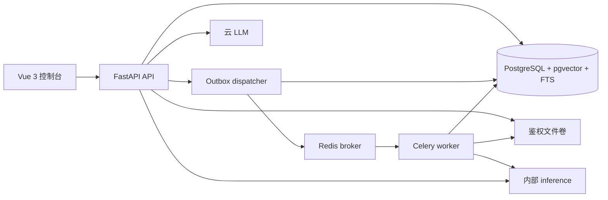

# 架构设计

> 设计状态：目标边界与当前实现状态并列记录；未实现部分仍不可据此声称可运行。

当前已实现数据库基础设施与三片业务表：API lifespan 创建并释放 SQLAlchemy AsyncEngine 与独立 Session 工厂，Alembic 迁移 `20260921_0001` 只启用 pgvector `vector` 扩展，`20260922_0002` 创建 `index_profile`、`knowledge_base`、`document`、`document_version`、`ingest_job`、`outbox_event` 六张业务表，`20260922_0003` 创建 `index_generation`、`chunk`、`chunk_embedding` 并给 `ingest_job` 补可空 `generation_id`，逐表配置 api/worker 的 DML 授权；`20260923_0004` 创建 append-only 的 `llm_usage` 用量账本（api 仅 SELECT+INSERT，worker 无权限），并新增一次性真实 DeepSeek 探针 `evidencehub.llm_probe`（显式 opt-in 且需独立密钥、固定 HTTPS endpoint、零重试、失败/超时也追加事实、token 缺失按失败处理），但真实计费调用尚未执行，到供应商的连通性与实际用量仍未被实测。Windows 上应用启动与在线迁移都显式使用 `SelectorEventLoop`，因为 psycopg 异步模式不兼容默认的 `ProactorEventLoop`。首迁移已在真实 PostgreSQL 17.11 + pgvector 0.8.6 上完成升级、512 维字面量解析与降级的实测；三片业务表也已在同一版本的专用测试库上完成真实迁移与授权验收（第三切片聚焦 17 passed，全部 `uv run pytest -m integration -q` 为 42 passed、2 skipped，核对 10 表、具名约束、GIN 与部分唯一索引、append-only 账本、无 sequence/ENUM/ANN、api/worker 授权差异、512 维列约束与降级无残留）；但尚无 worker 写入事务、认证授权、检索和问答实现，`chunk` 跨表冗余一致性与 `chunk_embedding.profile_id` 一致性也尚未由数据库强制。本地数据与 worker 切片已建立并完成真实启动验收：`deploy/compose/compose.yml` 现编排 postgres、redis、worker、api、inference 与 frontend-gateway 六服务，第三方镜像按 digest 固定、宿主端口只绑定回环地址，api/worker 由仓库 `deploy/compose/Dockerfile` 的 target 构建；PostgreSQL 官方入口创建 `citemind_migrator` 迁移超级用户，initdb 脚本再创建 `citemind_api`、`citemind_worker` 与 `citemind_test` 并收紧 ACL。worker 只注册无业务副作用的 `evidencehub.probe` 诊断任务，使用带认证 Redis broker 且不配置 result backend；默认只回显，只有配置受信 marker 目录时才原子写入诊断 marker。容器健康、迁移、角色 ACL、Redis 鉴权，以及 Linux Compose worker 接收并执行任务（由共享 marker 卷与 queue-probe 退出码判定）均已在隔离 Compose 项目中实测。六服务切片的 api、inference 与 frontend-gateway 容器现已建立并在同一次真实启动中验收：api 与 worker 复用同一 runtime stage（非 root 10001，容器内使用 `postgres:5432` DSN），inference 用独立 `inference/` 项目构建（非 root 10002，构建期把固定 revision 的 BAAI/bge-small-zh-v1.5 配置、tokenizer 与 safetensors 校验后烘入镜像，运行期在导入 torch 前复用包内钉死摘要与 `model-manifest.json` 离线复核六个产物、再以 `AutoModel` 显式 safetensors 且禁用 remote code 离线加载，受保护 `/internal/embed` 对 `kind=document` 返回 512 维向量），frontend-gateway 用 Node 24 构建静态产物并由非 root nginx 提供 8080，是唯一发布回环宿主端口的应用入口，同源代理 `/api/v1/health`、SPA fallback、安全头与 api 故障时的 502 均已核对。真实 embedding 中只有离线 `document` 编码已实现并实测；一次性真实计费 LLM 探针已提供但尚未执行，worker 写入事务、dispatcher、认证授权与业务路由仍未实现。

## 组成与职责

单仓库、Python 模块化单体，按 API、worker、inference 三种进程角色运行。PostgreSQL 是用户、文档、任务、版本、向量与关键词索引的事实来源；Redis 仅用于消息投递和短期限流。文件保存在项目专用卷，由 API 鉴权后读取，不提供永久公开 URL。前端作为静态资源由网关提供。低配实例的 outbox dispatcher 由唯一 API 进程的 lifespan 承载；多 API 实例时拆成单独进程，领取事件必须依赖数据库租约。

建议后端包边界：`api` 处理 HTTP 和依赖注入，`schemas` 负责输入输出契约，`auth` 产生服务端授权上下文，`knowledge`/`ingestion`/`retrieval`/`conversation`/`generation`/`evaluation` 承担用例，`parsing`/`indexing` 负责离线处理，repository 负责参数化 SQL。inference 仅暴露受限的内部 embedding/rerank 接口，不判断用户权限。

## 两条主链

1. **入库**：API 校验编辑权限和文件限额，保存原文件，并在一个事务中创建版本、`ingest_job` 和 `outbox_event`；dispatcher 投递 `jobId`；worker 解析、切分、编码并写入暂存 generation；校验完成后事务切换有效版本。详见 [入库与版本](ingestion.md)。
2. **问答**：API 校验会话与 KB 范围，必要时改写追问；检索服务用同一授权和版本快照运行向量与关键词两路，融合并限量选择证据；授权复核后调用 LLM；校验回答结构、引用与当前权限后保存并返回。详见 [检索与问答](retrieval.md)。

## 一致性和信任边界

- 每个检索候选都必须属于当前组织、授权 KB、未删除文档的当前版本和 READY generation。权限过滤发生在两路 SQL 内；后置 Python filter 只能增加防护。
- 同一文档更新时，旧版继续服务至新版完整就绪。发布事务锁定文档，核对期望版本与租约，退役旧 generation，发布新 generation 并更新指针。模型 profile 切换属于独立的 KB 级操作。
- 查询记录所用版本；回答前若相关版本变化，最多重新检索一次。持续变化返回可重试状态。撤权后新请求和历史访问都失效；已经传给外部模型或客户端的字节无法撤回。
- 原文是低信任数据；任何其中的“指令”都不改变系统权限、工具或输出 schema。云模型请求只包含必要的、经授权的证据。
- 单组织内隔离是计划范围。`organization_id` 从会话得到；没有跨租户安全验收前不声称多租户 SaaS 能力。

## 资源与失败边界

API 以短事务读取候选 DTO，释放连接后等待 inference/LLM。一个请求或 task 使用独立 SQLAlchemy Session；同一个 AsyncSession 不在并行协程间共享。解析在受资源限制的 worker 子进程中运行，推理服务单进程加载模型并限制线程、批量和并发。上传成功只表示任务持久化，不能表示索引可用。worker、Redis 或 LLM 出错应有明确状态；导入失败不能使当前有效文档下线。运行 profile 见 [部署设计](deployment.md)。
