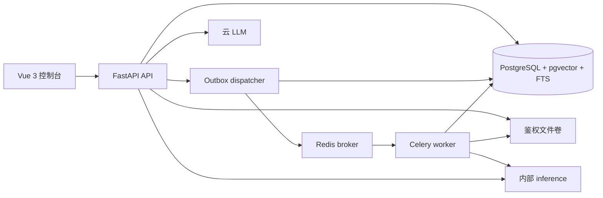

# 架构设计

> 设计状态：目标边界与当前实现状态并列记录；未实现部分仍不可据此声称可运行。

当前已实现数据库基础设施与三片业务表：API lifespan 创建并释放 SQLAlchemy AsyncEngine 与独立 Session 工厂，Alembic 迁移 `20260921_0001` 只启用 pgvector `vector` 扩展，`20260922_0002` 创建 `index_profile`、`knowledge_base`、`document`、`document_version`、`ingest_job`、`outbox_event` 六张业务表，`20260922_0003` 创建 `index_generation`、`chunk`、`chunk_embedding` 并给 `ingest_job` 补可空 `generation_id`，逐表配置 api/worker 的 DML 授权；`20260923_0004` 创建 append-only 的 `llm_usage` 用量账本（api 仅 SELECT+INSERT，worker 无权限），并新增一次性真实 DeepSeek 探针 `rag_backend.llm_probe`（显式 opt-in 且需独立密钥、固定 HTTPS endpoint、零重试、失败/超时也追加事实、token 缺失按失败处理）；该探针已由用户实际执行一次真实成功调用并以 `citemind_api` 回读账本，供应商连通性与实际 provider usage 已实测一次（价目与费用仍为 NULL，真实失败/超时路径未由 provider 实测），详见 [开发约定](development.md)。Windows 上应用启动与在线迁移都显式使用 `SelectorEventLoop`，因为 psycopg 异步模式不兼容默认的 `ProactorEventLoop`。首迁移已在真实 PostgreSQL 17.11 + pgvector 0.8.6 上完成升级、512 维字面量解析与降级的实测；三片业务表也已在同一版本的专用测试库上完成真实迁移与授权验收（第三切片聚焦 17 passed，全部 `uv run pytest -m integration -q` 为 42 passed、2 skipped，核对 10 表、具名约束、GIN 与部分唯一索引、append-only 账本、无 sequence/ENUM/ANN、api/worker 授权差异、512 维列约束与降级无残留）；但认证与 KB 成员授权已实现（服务端 `require_kb_role` 与 `GET/POST /api/v1/knowledge-bases`、成员读取与全量替换），Markdown 上传受理（`POST /api/v1/knowledge-bases/{id}/documents`，校验后在单事务写入 `document`/`document_version`/`ingest_job`/`outbox_event` 并返回 `202`）也已实现；dispatcher 与 worker 接收壳已在隔离 PostgreSQL/Redis/Celery 上验收（API 单进程 lifespan 可按配置运行 dispatcher，Compose 的 api 服务显式启用而宿主 Settings 默认关闭；物理 Redis 停启与 Windows solo worker kill 后补偿由仓库外隔离手工探针实测，不计入 pytest 自动用例，Linux prefork 业务故障未验收），worker 侧解析接线与入库事务已由**默认关闭**的真实入库管线 `rag_backend.ingestion.indexing_worker` 实现并端到端验收，授权混合检索首片（权限过滤向量+关键词+RRF）已实现、证据问答主流程也已实现（迁移 `20260927_0009`，见“两条主链”第 2 条），真实入库管线的前置能力包括纯 Markdown 解析/切分模块（文本 PDF 最小兼容切片另新增按页抽取的 `rag_backend.ingestion.pdf_parsing`、`locator_version=2` 页定位与 `NEEDS_OCR` 终态，`pypdf` 仅在 dev/worker 依赖组、api 镜像不安装，无新迁移；解析硬时限与有界返回体不等同内存隔离——PDF 压缩流膨胀（解压炸弹）目前只受页数（200）、单文件字节（20,000,000）与子进程 60 秒硬时限约束，尚无 rlimit/cgroup 内存硬限）、index profile 契约模块（纯标准库；独立 review APPROVED 与隔离镜像 tester 已验收，21 passed）、worker 本地真实 token 计数器、内部 embedding 客户端、纯身份预检模块 `rag_backend.ingestion.identity_preflight`（只 import 标准库、无 IO/DB/Celery/marker/ACK；独立 reviewer APPROVED 与独立 tester 已验收）与 worker 专用索引身份工厂 `rag_backend.ingestion.worker_index_identity`（只有显式调用才按大小+SHA-256 校验四件 tokenizer 资产、构造真实 `KeywordAnalyzer` 与七字段契约并缓存成功结果；独立 reviewer 代码 APPROVED，独立 tester 已在真 worker 镜像内验收）；隔离 PG17+Redis pipeline 15 passed + 权限迁移 3 passed，Linux prefork concurrency 1 真离线模型端到端 PG `0007` READY，详见 [开发约定](development.md)），`chunk` 跨表冗余一致性与 `chunk_embedding.profile_id` 一致性也尚未由数据库强制。本地数据与 worker 切片已建立并完成真实启动验收：`deploy/compose/compose.yml` 现编排 postgres、redis、worker、api、inference 与 frontend-gateway 六服务，第三方镜像按 digest 固定、宿主端口只绑定回环地址，api/worker 由仓库 `deploy/compose/Dockerfile` 的 target 构建；PostgreSQL 官方入口创建 `citemind_migrator` 迁移超级用户，initdb 脚本再创建 `citemind_api`、`citemind_worker` 与 `citemind_test` 并收紧 ACL。worker 注册无业务副作用的 `rag_backend.probe` 诊断任务与 `rag_backend.ingest` 接收壳（合格 job 只写 job 级接收标记，`status` 仍 `QUEUED`、`error_code=HANDLER_NOT_READY`；无接收标记但已有非 NULL 诊断码的旧 job 保持原样、只返回只读状态，只有无接收标记且 `error_code IS NULL` 的旧 job 仅置 `FAILED`+`LEGACY_JOB_UNSUPPORTED`，不补绑、不重投（已由独立 tester 在隔离 PG17+Redis 与 Linux prefork worker 镜像上最终验收）；默认关闭时各路径都不解析、不可检索；显式开启 `INGEST_PROCESSING_ENABLED=1` 时同一任务进入真实入库管线），使用带认证 Redis broker 且不配置 result backend；probe 默认只回显，只有配置受信 marker 目录时才原子写入诊断 marker。容器健康、迁移、角色 ACL、Redis 鉴权，以及 Linux Compose worker 接收并执行任务（由共享 marker 卷与 queue-probe 退出码判定）均已在隔离 Compose 项目中实测。六服务切片的 api、inference 与 frontend-gateway 容器现已建立并在同一次真实启动中验收：api 与 worker 复用同一 runtime stage（非 root 10001，容器内使用 `postgres:5432` DSN），inference 用独立 `inference/` 项目构建（非 root 10002，构建期把固定 revision 的 BAAI/bge-small-zh-v1.5 配置、tokenizer 与 safetensors 校验后烘入镜像，运行期在导入 torch 前复用包内钉死摘要与 `model-manifest.json` 离线复核六个产物、再以 `AutoModel` 显式 safetensors 且禁用 remote code 离线加载，受保护 `/internal/embed` 对 `kind=document` 返回 512 维向量，`kind=query` 的 instruction 前缀契约 `bge-zh-query-v1` 已实现并已由隔离模型 tester 在真实权重与真实 HTTP 上验收），frontend-gateway 用 Node 24 构建静态产物并由非 root nginx 提供 8080，是唯一发布回环宿主端口的应用入口，同源代理 `/api/v1/health`、SPA fallback、安全头与 api 故障时的 502 均已核对。真实 embedding 中离线 `document` 编码已实现并实测，`query` 编码已实现（前缀契约 `bge-zh-query-v1`）并已由隔离模型 tester 在真实权重上验收，访问授权的检索路由/SQL 已实现首片（`POST /api/v1/retrieval/search`）；一次性真实计费 LLM 探针已提供并已完成一次真实成功调用与账本回读；认证与 KB 成员授权已实现并验收，Markdown 上传受理已由 HEAD `81ce084` 提交且仅负责受理，新上传写路径在 publish 前只读预检默认 profile、再在同一四表事务内登记/复用默认全局 index profile 并显式绑定 `ingest_job.profile_id`（独立 tester 已在隔离 PostgreSQL 17 + Redis 上验收，见 [开发约定](development.md)；确定性 profile 错配孤儿路径已由预检缓解、`_insert_upload` 去重误分类已收窄，其它孤儿路径与 GC/配额/告警仍未实现）；dispatcher 与 worker 接收壳已在隔离 PostgreSQL/Redis/Celery 上验收（物理 Redis 停启与 Windows solo worker kill 后补偿由仓库外隔离手工探针实测，不计入 pytest 自动用例，Linux prefork 业务故障未验收），worker 侧解析接线与索引写入已由默认关闭的真实入库管线实现并端到端验收（见下），授权检索首片与证据问答主流程也已实现（问答默认关闭、未对真实 provider 验收，见“两条主链”第 2 条）；当前 dev 库仍为 `20260923_0005`、dev 六服务未部署该新代码、真实处理开关默认关闭。

## 组成与职责

单仓库、Python 模块化单体，按 API、worker、inference 三种进程角色运行。PostgreSQL 是用户、文档、任务、版本、向量与关键词索引的事实来源；Redis 仅用于消息投递和短期限流。文件保存在 `api-documents` 专用卷：API 写入，API 读取前先鉴权；worker 以只读方式挂载同一卷供默认关闭的真实入库管线读取（`read_verified_markdown` 已实现并由该管线在领取任务后调用），inference 不挂载；不提供永久公开 URL。前端作为静态资源由网关提供。低配实例的 outbox dispatcher 由唯一 API 进程的 lifespan 按配置承载（`DISPATCHER_ENABLED`，宿主默认关闭、Compose 显式开启）；多 API 实例时拆成单独进程，领取事件必须依赖数据库租约。

建议后端包边界：`api` 处理 HTTP 和依赖注入，`schemas` 负责输入输出契约，`auth` 产生服务端授权上下文，`knowledge`/`ingestion`/`retrieval`/`conversation`/`generation`/`evaluation` 承担用例，`parsing`/`indexing` 负责离线处理，repository 负责参数化 SQL。inference 仅暴露受限的内部 embedding/rerank 接口，不判断用户权限；worker 侧另有受限的内部 embedding 客户端（同步 `httpx`、Bearer `INFERENCE_TOKEN`、`trust_env=False`、`retries=0`、只连内部 `inference:9000`，已由默认关闭的真实入库管线接线）。

## 两条主链

1. **入库（目标流程）**：API 校验编辑权限和文件限额，保存原文件，并在一个事务中创建版本、`ingest_job` 和 `outbox_event`；dispatcher 投递 `jobId`；worker 解析、切分、编码并写入暂存 generation；校验完成后事务切换有效版本（首次 READY 发布同时把 KB 的 `active_index_profile_id` 置为该 profile）。当前已实现：API 受理与四表写入（单个事务，返回 `202`）已落地，outbox dispatcher 与 worker 接收壳已由 HEAD `be61f2b` 落地并在隔离 PostgreSQL/Redis/Celery 上验收（物理 Redis 停启与 Windows solo worker kill 后补偿由仓库外隔离手工探针实测，不计入 pytest 自动用例，Linux prefork 业务故障未验收），worker 侧本地真实 token 计数器（从 inference 镜像复制固定 BGE tokenizer 四件、按大小+SHA256 校验后离线加载）也已实现，worker 读取 blob、落库 `chunk`/`generation`、索引发布已由默认关闭的真实入库管线实现并端到端验收；worker 侧另新增纯身份预检模块 `rag_backend.ingestion.identity_preflight`（只 import 标准库、无 IO/DB/Celery/marker/ACK；八类互斥静态判定，只有 profile id、七字段、`config_hash`、parser 版本与来源全匹配才 `ALLOWED`；独立 reviewer APPROVED 与独立 tester 已验收）与 worker 专用索引身份工厂 `rag_backend.ingestion.worker_index_identity`（只有显式调用才核对四件 tokenizer 资产、只构造一次 `KeywordAnalyzer` 并构造七字段契约，失败静态脱敏；独立 reviewer 代码 APPROVED，独立 tester 已在真 worker 镜像内验收），`worker.py` 不直接导入这些模块，而是按需导入默认关闭的真实入库管线；**开关关闭时**合格 job 的接收壳仍只写 `HANDLER_NOT_READY`、`job.status` 仍为 `QUEUED`，`ALLOWED` 与合法工厂结果本身也不等于 READY 或可检索；`ingest_job.profile_id` 已由迁移 `20260925_0006` 增加可空外键；新上传写路径在 publish 前只读预检同 `config_hash` 既有行（不一致 fail closed），再在同一四表事务内登记默认全局 index profile 并显式绑定该列（独立 tester 已验收），但既有 `QUEUED`/`HANDLER_NOT_READY` 任务保持 NULL，不得按新 default profile 契约自动处理、补绑或重投。接收壳对合格 job 只写 `HANDLER_NOT_READY` 接收标记、状态仍为 `QUEUED`，对无接收标记但已有非 NULL 诊断码的旧 job 保持原样、只返回只读状态，对无接收标记且 `error_code IS NULL` 的旧 job 才置 `FAILED`+`LEGACY_JOB_UNSUPPORTED`（已最终验收），outbox `SENT` 也不等于解析/入库；当前 dev 库仍为 `20260923_0005`、dev 六服务未部署该新代码、真实处理开关默认关闭，且 dev 库没有 READY 索引，因此上传后仍不可检索。详见 [入库与版本](ingestion.md)。
2. **问答**：API 校验会话与 KB 范围，必要时改写追问；检索服务用同一授权和版本快照运行向量与关键词两路，融合并限量选择证据；授权复核后调用 LLM；校验回答结构、引用与当前权限后保存并返回。详见 [检索与问答](retrieval.md)。当前已实现（迁移 `20260927_0009` + `rag_backend.conversation`/`generation`/`api.conversations`）：`POST /api/v1/conversations`、`GET/POST /api/v1/conversations/{id}/messages`、`GET /api/v1/citations/{id}`；会话按所有者隔离，每次追问与每次引用读取都从数据库重建 `kb_member` 并由同一授权 SQL 重新检索，无入选证据时直接拒答且不调用模型；证据 locator/短引文全部由服务端从已保存 chunk 映射，模型只能返回临时 `E` 编号；每次真实 provider attempt 都追加 `llm_usage` 事实，模型前与交付前各复核一次证据授权与版本，版本变化最多重新检索一次、持续变化返回静态 409。生成总开关 `LLM_ENABLED` 默认关闭，关闭时端点静态 503 且不联网。本片未接入追问改写模型、重排降级标记与真实 provider 连通性验收。

## 一致性和信任边界

- 每个检索候选都必须属于当前组织、授权 KB、未删除文档的当前版本和 READY generation，且所用 profile 等于该 KB 的 `active_index_profile_id`（指针为 NULL 的 KB 不可检索）。权限过滤发生在两路 SQL 内；后置 Python filter 只能增加防护。关键词路还要求 profile 的 `keyword_analyzer_version` 与运行期分析器身份一致，不一致 fail closed，避免换词典后用新词项流查旧 `chunk.fts`。
- 同一文档更新时，旧版继续服务至新版完整就绪。模型 profile 切换与 generation 退役/重建属独立的 KB 级操作（退役/重建见未来 `POST /documents/{id}/reindex` 契约），本切片不退役旧 generation。已实现（文档更新/删除切片，迁移 `20260926_0008` 新增可空 `ingest_job.request_title`）：`POST /documents/{id}/versions` 在文档行锁内分配 `version_no` 并用含 docId/expected 的去重键幂等，标题身份取受理时固化的 `request_title`（旧 NULL 行回退 `document.title`），因此改展示标题不破坏原 key 重放；worker 发布事务在同一 `document` 行锁内 compare `active_version_id == expected_active` 且未删除才置新 generation/版本 `READY` 并切换指针，旧版本无需退役但不入检索（检索按 `active_version_id` 过滤），失败不下线旧版；领取期发现 expected 已被更早发布超越时静态拒绝为 `PIPELINE_STALE_EXPECTED`，发布 CAS 保留作并发变化最后防线。`DELETE /documents/{id}`（OWNER）只做逻辑 tombstone 并递增 `kb_revision`、终止该文档非终态 `ingest_job`，双路检索立即零候选；删除锁序与 worker 相反时可能死锁，由 API 侧完整事务重试收敛；不删共享 blob、不做物理回收。`knowledge_base.active_index_profile_id` 只表示该 KB 已发布索引当前使用的 profile；尚无 READY 索引的 KB 保持 NULL，全局登记的默认 profile 不使其可检索，上传事务不得回填该指针。`ingest_job.profile_id` 现在由新上传写路径绑定（独立 tester 已验收），但数据库不保证其不可变或与 generation 一致；默认关闭的真实入库管线已在发布事务内核对 `generation_id`/`profile_id` 一致，仍不得将其当作已冻结的绑定。
- 查询记录所用版本；回答前若相关版本变化，最多重新检索一次。持续变化返回可重试状态。撤权后新请求和历史访问都失效；已经传给外部模型或客户端的字节无法撤回。
- 原文是低信任数据；任何其中的“指令”都不改变系统权限、工具或输出 schema。云模型请求只包含必要的、经授权的证据。
- 单组织内隔离是计划范围。`organization_id` 从会话得到；没有跨租户安全验收前不声称多租户 SaaS 能力。

## 资源与失败边界

API 以短事务读取候选 DTO，释放连接后等待 inference/LLM。一个请求或 task 使用独立 SQLAlchemy Session；同一个 AsyncSession 不在并行协程间共享。解析在受控 `subprocess` 中运行，硬时限 60 秒、回传体上限 80 MB（`MAX_PARSE_RESULT_BYTES` 为 `MAX_MARKDOWN_BYTES` 的 4 倍）；未配置 CPU/内存 rlimit，父侧 `communicate` 依赖可信子侧遵守该输出上限，因此不能声称完整内存硬限。推理服务单进程加载模型并限制线程、批量和并发。上传成功只表示任务持久化，不能表示索引可用。worker、Redis 或 LLM 出错应有明确状态；导入失败不能使当前有效文档下线。运行 profile 见 [部署设计](deployment.md)。

> 真实入库管线（默认关闭，已端到端验收）：worker 侧真实入库管线 `rag_backend.ingestion.indexing_worker` 已实现并接入
> `rag_backend.ingest` 任务，但**默认关闭**：只有显式 `INGEST_PROCESSING_ENABLED=1` 时才在领取
> lease 后读取 blob、解析切分、编码、暂存 `index_generation`/`chunk`/`chunk_embedding` 并发布
> READY；默认仍走既有安全接收壳。迁移 `20260925_0007` 只给 worker 增加
> `knowledge_base(active_index_profile_id, kb_revision)` 列级 UPDATE，不授予全表 UPDATE。该管线
> 的代码、单元测试与真实 PG/模型整链已由独立 tester 验收（隔离 PostgreSQL 17 pipeline 15 passed
> + 权限迁移 3 passed；Linux prefork concurrency 1 真离线模型整链 PG `0007` READY，详见
> [开发约定](development.md)）；父 worker kill 后子进程回收与租约恢复、物理 Redis 停启、多 worker
> 与 p95 未测；处理中崩溃无自动恢复（无常驻 reaper）。详见
> [文档入库](ingestion.md) 的“已实现：worker 真实入库管线”。
